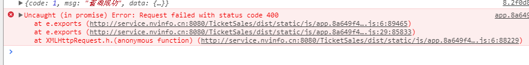

## 更新日志 ##
```
-	Version 1.2.1 景区管理新增景区页面添加加载动画
-	Version 1.3.1 景区管理新增/修改景区经纬度添加不上的问题,修改景区重新上传图片和选择业务人员验证不为空.
-	Version 1.3.2 修复订单管理导出Excle表格数据不对应的问题.

-	Version 2.0.0 element UI 版本修改为v2.0.7.
-	Version 2.1.0 产品管理修改产品添加修改日历价格功能(引用的是第三方jq插件 "calendar-pirce-jquery": "^1.0.2",).

-	Version 3.0.0 增加"特价商品管理"板块(包括增删改功能).
-	Version 3.1.0 产品修改价格日历板块[{{"date":"2018-01-17","price":"99.0"}],的转码encodeURI  %5B%7B%22date%22:%222018-01-16%22,%22price%22.
-	Version 3.2.0 合同管理板块合同的上传与删除功能进一步完善以及分销商之间的切换（暂时连续上传与删除需进一步完善）.

```


Version 3.1.0 报错提示
错误的原因是  [ { } ]  符号没有转码,需要使用的转码encodeURI转码;

# manage-system #
基于Vue.js 2.x系列 + Element UI 的后台管理系统解决方案。[线上地址](http://blog.gdfengshuo.com/example/work/)

[English document](https://github.com/lin-xin/manage-system/blob/master/README_EN.md)


## 前言 ##
之前在公司用了Vue + Element组件库做了个后台管理系统，基本很多组件可以直接引用组件库的，但是也有一些需求无法满足。像图片裁剪上传、富文本编辑器、图表等这些在后台管理系统中很常见的功能，就需要引用其他的组件才能完成。从寻找组件，到使用组件的过程中，遇到了很多问题，也积累了宝贵的经验。所以我就把开发这个后台管理系统的经验，总结成这个后台管理系统解决方案。

该方案作为一套多功能的后台框架模板，适用于绝大部分的后台管理系统（Web Management System）开发。基于vue.js,使用vue-cli脚手架快速生成项目目录，引用Element UI组件库，方便开发快速简洁好看的组件。分离颜色样式，支持手动切换主题色，而且很方便使用自定义主题色。

## 功能 ##
- [1] Element UI
- [2] 登录/注销
- [3] 表格
- [4] 表单
- [5] 图表 :bar_chart:
- [6] 富文本编辑器
- [7] markdown编辑器
- [8] 图片拖拽/裁剪上传
- [9] 支持切换主题色 :sparkles:
- [10] 列表拖拽排序


## 目录结构介绍 ##

	|-- build                            // webpack配置文件
	|-- config                           // 项目打包路径
	|-- src                              // 源码目录
	|   |-- components                   // 组件
	|       |-- common                   // 公共组件
	|           |-- Header.vue           // 公共头部
	|           |-- Home.vue           	 // 公共路由入口
	|           |-- Sidebar.vue          // 公共左边栏
	|		|-- page                   	 // 主要路由页面
	|           |-- BaseCharts.vue       // 基础图表
	|           |-- BaseForm.vue         // 基础表单
	|           |-- BaseTable.vue        // 基础表格
	|           |-- Login.vue          	 // 登录
	|           |-- Markdown.vue         // markdown组件
	|           |-- Readme.vue           // 自述组件
	|           |-- Upload.vue           // 图片上传
	|           |-- VueEditor.vue        // 富文本编辑器
	|           |-- VueTable.vue         // vue表格组件
	|   |-- App.vue                      // 页面入口文件
	|   |-- main.js                      // 程序入口文件，加载各种公共组件
	|-- .babelrc                         // ES6语法编译配置
	|-- .editorconfig                    // 代码编写规格
	|-- .gitignore                       // 忽略的文件
	|-- index.html                       // 入口html文件
	|-- package.json                     // 项目及工具的依赖配置文件
	|-- README.md                        // 说明


## 安装步骤 ##

	git clone https://github.com/lin-xin/manage-system.git      // 把模板下载到本地
	cd manage-system    // 进入模板目录
	npm install         // 安装项目依赖，等待安装完成之后

## 本地开发 ##

	// 开启服务器，浏览器访问 http://localhost:8090
	npm run dev

## 构建生产 ##

	// 执行构建命令，生成的dist文件夹放在服务器下即可访问
	npm run build

## 组件使用说明与演示 ##

### vue-schart ###
vue.js封装sChart.js的图表组件。访问地址：[vue-schart](https://github.com/linxin/vue-schart)
<p><a href="https://www.npmjs.com/package/vue-schart"></a></p>

```JavaScript
<template>
    <div>
        <schart :canvasId="canvasId"
				:type="type"
				:width="width"
				:height="height"
				:data="data"
				:options="options"
		></schart>
    </div>
</template>
	
<script>
    import Schart from 'vue-schart';        // 导入Schart组件
    export default {
        data: function(){
            return {
                canvasId: 'myCanvas',       // canvas的id
                type: 'bar',                // 图表类型
                width: 500,
                height: 400,
                data: [
                    {name: '2014', value: 1342},
                    {name: '2015', value: 2123},
                    {name: '2016', value: 1654},
                    {name: '2017', value: 1795},
                ],
                options: {                  // 图表可选参数
                    title: 'Total sales of stores in recent years'
                }
            }
        },
        components: {
            Schart
        }
    }
</script>
```

### element-ui ###
一套基于vue.js2.0的桌面组件库。访问地址：[element](http://element.eleme.io/#/zh-CN/component/layout)

### vue-datasource ###
一个用于动态创建表格的vue.js服务端组件。访问地址：[vue-datasource](https://github.com/coderdiaz/vue-datasource)


### Vue-Quill-Editor ###
基于Quill、适用于Vue2的富文本编辑器。访问地址：[vue-quill-editor](https://github.com/surmon-china/vue-quill-editor)

### Vue-SimpleMDE ###
Vue.js的Markdown Editor组件。访问地址：[Vue-SimpleMDE](https://github.com/F-loat/vue-simplemde)


### Vue-Core-Image-Upload ###
一款轻量级的vue上传插件，支持裁剪。访问地址：[Vue-Core-Image-Upload](https://github.com/Vanthink-UED/vue-core-image-upload)


## 其他注意事项 ##
### 一、如果我不想用到上面的某些组件呢，那我怎么在模板中删除掉不影响到其他功能呢？ ###

举个栗子，我不想用 vue-datasource 这个组件，那我需要分四步走。

第一步：删除该组件的路由，在目录 src/router/index.js 中，找到引入改组件的路由，删除下面这段代码。

```JavaScript
{
    path: '/vuetable',
    component: resolve => require(['../components/page/VueTable.vue'], resolve)     // vue-datasource组件
},
```

第二步：删除引入该组件的文件。在目录 src/components/page/ 删除 VueTable.vue 文件。

第三步：删除该页面的入口。在目录 src/components/common/Sidebar.vue 中，找到该入口，删除下面这段代码。
	
```HTML
<el-menu-item index="vuetable">Vue表格组件</el-menu-item>
```

第四步：卸载该组件。执行以下命令：
	
	npm un vue-datasource -S

完成。

### 二、如何切换主题色呢？ ###

第一步：打开 src/main.js 文件，找到引入 element 样式的地方，换成浅绿色主题。

```javascript
import 'element-ui/lib/theme-default/index.css';    // 默认主题
// import '../static/css/theme-green/index.css';       // 浅绿色主题
```

第二步：打开 src/App.vue 文件，找到 style 标签引入样式的地方，切换成浅绿色主题。

```javascript
@import "../static/css/main.css";
@import "../static/css/color-dark.css";     /*深色主题*/
/*@import "../static/css/theme-green/color-green.css";   !*浅绿色主题*!*/
```

第三步：打开 src/components/common/Sidebar.vue 文件，找到 el-menu 标签，把 theme="dark" 去掉即可。

## 项目截图 ##
### 默认皮肤 ###


### 浅绿色皮肤 ###

